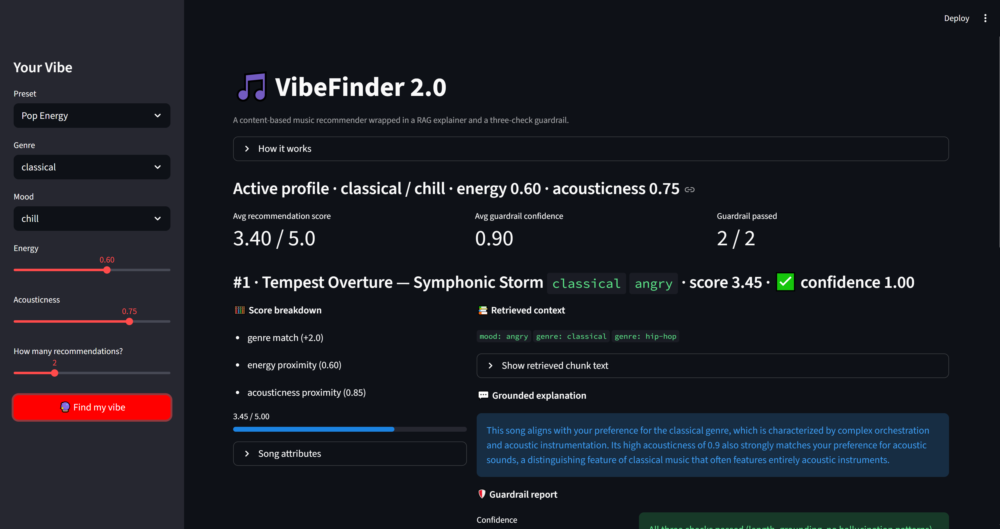
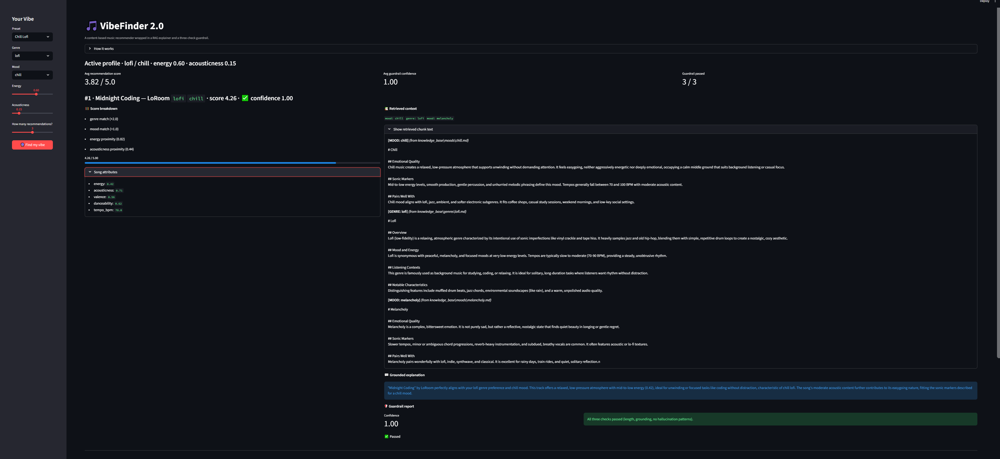

# VibeFinder 2.0: Applied AI Music Recommender

**Summary**  
VibeFinder 2.0 is an applied AI system that extends a static, content-based music recommender into a dynamic, Retrieval-Augmented Generation (RAG) pipeline. It calculates personalized song recommendations based on user profiles and leverages Gemini 1.5 Flash to generate grounded, explainable reasoning for why each song fits the user's vibe, complete with automated hallucination guardrails.

**Base Project: VibeFinder 1.0**  
This system extends my original "Module 3 Music Recommender Simulation" (VibeFinder 1.0). That initial project loaded a CSV catalog of 18 songs and used hardcoded math (proximity scoring) to rank songs based solely on genre and mood overlap with a user's profile.

**What's New in 2.0**  
- **RAG Retriever:** A TF-IDF search engine that queries a custom Markdown knowledge base of genres and moods.
- **Gemini Explainer:** An LLM that uses grounded context to write 2-3 sentence explanations for recommendations.
- **Hallucination Guardrail:** A deterministic pipeline that docks confidence scores for length violations, low lexical overlap with retrieved chunks, or forbidden hallucination patterns.
 
**Architecture Overview**  
  
When a user profile is submitted via the CLI, the static recommender selects the top-k songs from the catalog. The RAG Retriever then pulls relevant Markdown chunks for those specific genres and moods, passing them to Gemini to generate an explanation. Finally, the guardrail validates the explanation against the retrieved chunks, returning a confidence score to the terminal.

**Setup Instructions**  
1. Clone the repository to your local machine.
2. Create and activate a virtual environment (PowerShell):
   `python -m venv venv`
   `.\venv\Scripts\activate`
3. Install dependencies:
   `pip install -r requirements.txt`
4. Create a `.env` file in the root directory and add your API key:
   `GEMINI_API_KEY=your_actual_key_here`
5. Run the end-to-end pipeline:
   `python -m src.main`

**Sample Interactions**

### Streamlit UI

The full RAG pipeline is exposed visually — every recommendation card shows the scoring math, retrieved knowledge base chunks, grounded Gemini explanation, and guardrail report side-by-side. Run it with `streamlit run app.py`.

Expanding the retrieved chunks reveals the exact markdown content the LLM was grounded on, making the RAG pipeline fully auditable:

### CLI Output

The original CLI pipeline still works for headless runs and demo recordings. Below are three preset profiles:

*Late Night R&B Profile:*

*Pop Energy Profile:*

*Chill Lofi Profile:*

**Reliability & Guardrails**  
The guardrail is fully deterministic — no second LLM call is made. It starts at `confidence = 1.0` and applies three weighted checks:
1. **Length check (−0.2):** The explanation must contain 1–5 sentences (split on `.!?`). Violations dock 0.2.
2. **Lexical grounding check (−0.5):** At least 30% of the explanation's meaningful tokens (≥4 chars, non-stopword) must appear in the retrieved chunks. Falling below this threshold docks 0.5.
3. **Hallucination pattern check (−0.3):** A regex scan flags year patterns (`19xx`/`20xx`), and phrases such as "released in", "peaked at", "Billboard", "Grammy", "chart", "album of the year", "debut album", and "record label". Any match docks 0.3.

An explanation **passes** (`passed = True`) when `confidence >= 0.7`.

**Design Decisions**  
- **TF-IDF over Embeddings:** For a highly structured, keyword-dense knowledge base (genres and moods), TF-IDF is faster, cheaper, and more accurate than dense vector embeddings.
- **Gemini 1.5 Flash:** Chosen for its speed and generous free tier, making it ideal for processing multiple RAG explanations in a CLI loop.
- **Content-Based Recommender:** Retained from VibeFinder 1.0 because collaborative filtering suffers from the "cold start" problem without massive user datasets.

**Testing Summary**  
Unit tests execute successfully via `python -m pytest`. The guardrail script (`evaluator.py`) successfully caught hallucinations across three controlled test cases, correctly dropping confidence scores to 0.20 when the LLM invented release years and chart data.

[Watch the walkthrough on Loom](https://www.loom.com/share/54d8c75bfae7444ba1a8fcfc74fab59a)

**Reflection & AI Collaboration**  
AI was instrumental in accelerating the architecture of this system. I used it heavily for scaffolding the RAG file structure and generating the `google-genai` integration scripts, allowing me to focus on prompt engineering and system design rather than boilerplate code.

A highly helpful AI suggestion occurred during the retriever design. Claude Code correctly suggested using a TF-IDF implementation via `scikit-learn` rather than a complex vector database, which perfectly matched the scope and scale of my 24-document knowledge base. Conversely, a flawed AI suggestion occurred during the knowledge base creation. When asked to batch-generate the Markdown files, the AI simply created 6 empty mood files instead of populating them with the requested content, requiring manual intervention to write the data.

The biggest limitation of this system is that the LLM is restricted by the small 18-song baseline catalog and a heavily sanitized knowledge base. Future iterations could integrate Spotify's API for dynamic catalog generation and utilize a full vector database (like ChromaDB) to retrieve complex music theory documentation.